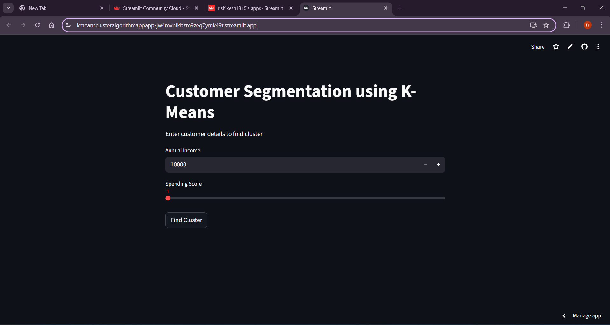
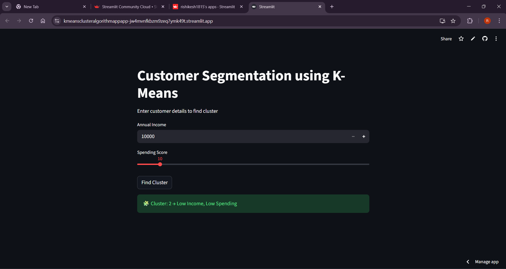
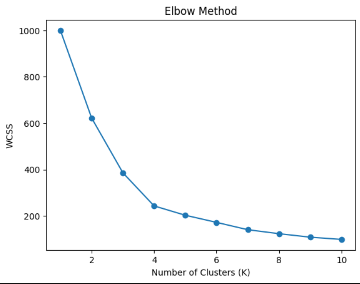

#  Customer Segmentation using K-Means Clustering

##  Project Overview

This project is an **Unsupervised Machine Learning application** that performs Customer Segmentation using the K-Means Clustering algorithm.

It demonstrates how businesses can group customers based on behavioral patterns such as income and spending habits.

The project is deployed as an interactive **Streamlit web application**, showcasing a complete end-to-end ML workflow.

---

##  Business Problem

Businesses often struggle to understand different customer types within their market.

Without segmentation:
- Marketing campaigns become inefficient
- High-value customers are not identified
- Personalization becomes difficult

This project solves that problem by grouping customers into meaningful segments using data-driven clustering.

---

##  What This Application Does

• Takes **Annual Income** and **Spending Score** as input  
• Uses **K-Means Clustering** to group customers  
• Identifies customer segments such as:

  - Low Income – Low Spending  
  - Low Income – High Spending  
  - High Income – Low Spending  
  - High Income – High Spending  

• Displays:
  - Cluster number  
  - Real-world business interpretation  
  - Segment meaning for decision-making  

---

##  Machine Learning Approach

### Model Type:
Unsupervised Learning

### Algorithm Used:
K-Means Clustering

### Key Concepts Applied:

• Elbow Method (to determine optimal number of clusters)  
• Feature Scaling using StandardScaler  
• Cluster interpretation using centroids  
• Customer behavior analysis  

---

##  Tech Stack

• Python  
• Scikit-learn (KMeans, StandardScaler)  
• Pandas  
• NumPy  
• Streamlit  
• Joblib  

---

##  Project Workflow

1. Data preprocessing and cleaning  
2. Feature scaling  
3. Applying Elbow Method to find optimal K  
4. Training K-Means clustering model  
5. Saving trained model using Joblib  
6. Deploying interactive Streamlit web application  

---

##  Model Output

The model successfully groups customers into distinct segments based on similarities in income and spending behavior.

This segmentation can be used for:
- Targeted marketing
- Personalized promotions
- Customer retention strategies
- Business growth planning

---

##  Application Screenshots

### 🔹 Input Interface

---

### 🔹 Cluster Prediction Output

---

### 🔹 Elbow Method Visualization

---

##  Live Application

Live Demo: (https://kmeansclusteralgorithmappapp-jw4mvnfkbzm9zeq7ymk49t.streamlit.app/)

---

##  Learning Outcomes

• Clear understanding of Unsupervised Learning  
• Difference between supervised vs unsupervised models  
• Practical implementation of K-Means Clustering  
• Using Elbow Method to determine optimal clusters  
• Business interpretation of machine learning outputs  
• Deploying ML models as interactive applications  

---

##  Author

**RISHIKESH S**  
Aspiring Product Manager 

LinkedIn: (https://www.linkedin.com/in/rishikesh-s-77287633b/)

---

##  Project Purpose

This project demonstrates practical understanding of **Unsupervised Machine Learning** and how clustering techniques are applied to real-world business problems like customer segmentation.
